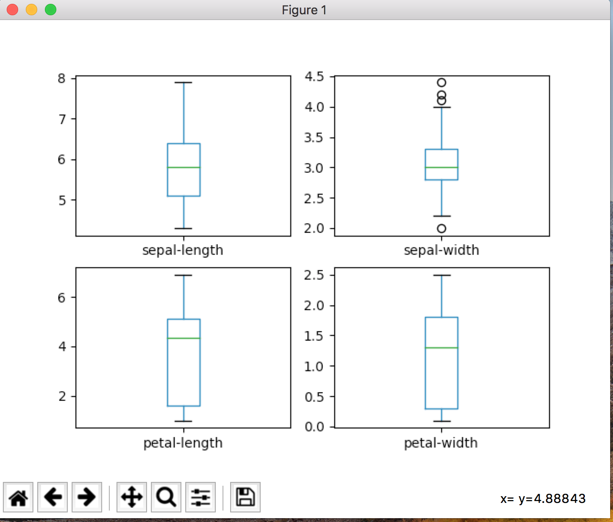
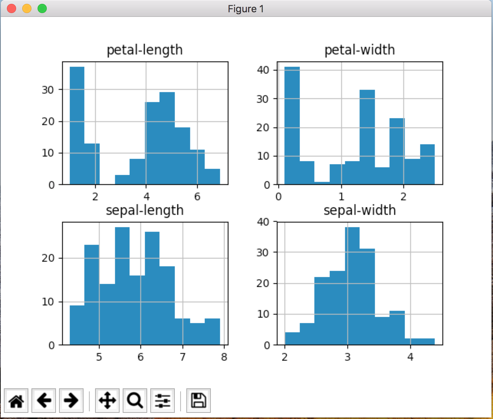
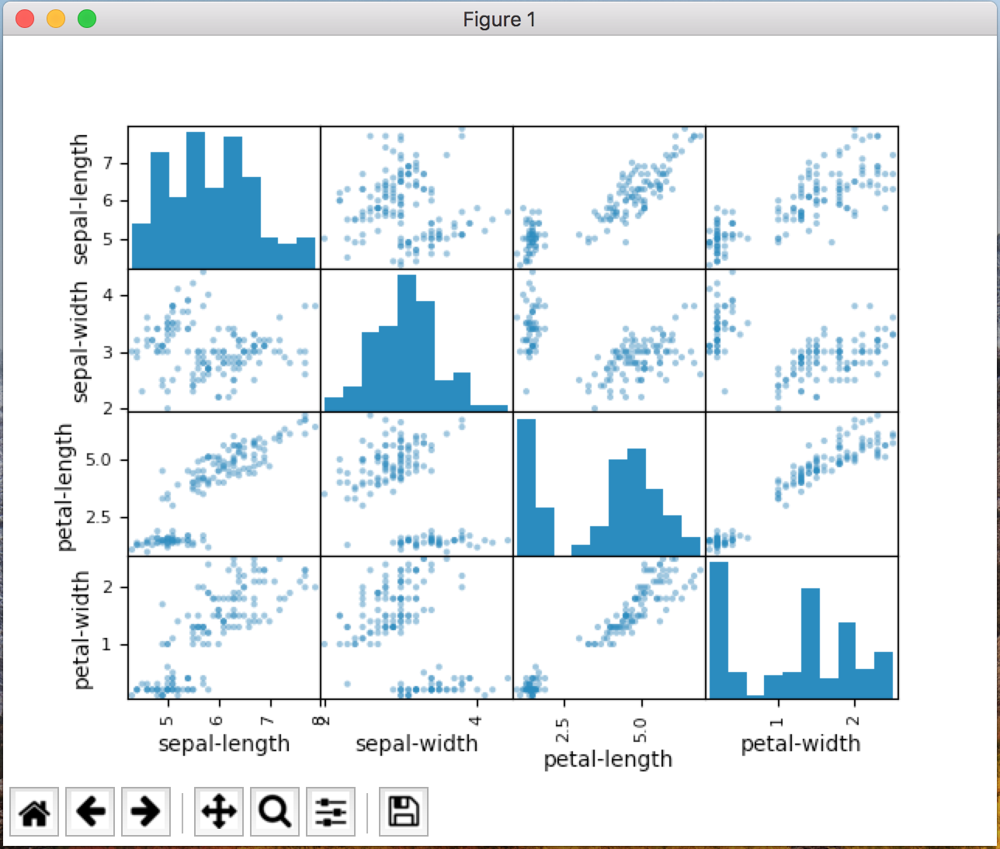
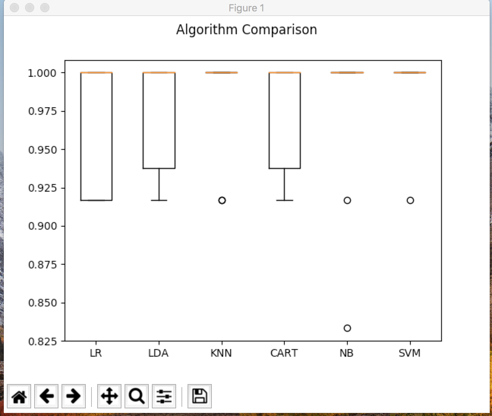

MACHINE LEARNING EXAMPLE
===========

This is a short example that how machine learning works with python.

Find out more at `source <https://machinelearningmastery.com/machine-learning-in-python-step-by-step/>`_

.. image:: https://3qeqpr26caki16dnhd19sv6by6v-wpengine.netdna-ssl.com/wp-content/uploads/2014/07/MachineLearningMasteryWithPython-220px.png
   :width: 728 px

Getting started
~~~~~~~~~~~~~~~

.. code-block:: sh

	git clone git@github.com:avarajar/machine-learning-in-python-step-by-step.git
    virtualenv <env_name>
    source env_name/bin/activate
    cd machine-learning-in-python-step-by-step
    pip install -r requirements.txt

For detailed virtualenv see `virtualenv <https://virtualenv.pypa.io/en/stable/>`_.

MAC(OSX) issue
~~~~~~~~~~~~~~~

if you have this error:.

**RuntimeError: Python is not installed as a framework. The Mac OS X backend will not be able to function correctly if Python is not installed as a framework**

Problem Cause MacOS has a different image rendering back-end for matplotlib (The back-end renderer using the API of Cocoa by default). There are two types of renderers: Qt4Agg and GTKAgg. MacOS has a different default (than Windows or Linux, etc) so you'll need to set the back-end renderer of MacOSx.

I resolved this issue this way:

I assume you have installed the pip matplotlib, there is a directory in you root called *~/.matplotlib.*
Create a file *~/.matplotlib/matplotlibrc* there and add the following code: *backend: TkAgg*

Run machine learning script
~~~~~~~~~~~~~~~

.. code-block:: sh

	python example_script.py

SCREENSHOTS
~~~~~~~~~~~~~~~

Univariate Plots
~~~~~~~~~~~~~~~

Multivariate Plots
~~~~~~~~~~~~~~~

Better Model
~~~~~~~~~~~~~~~

